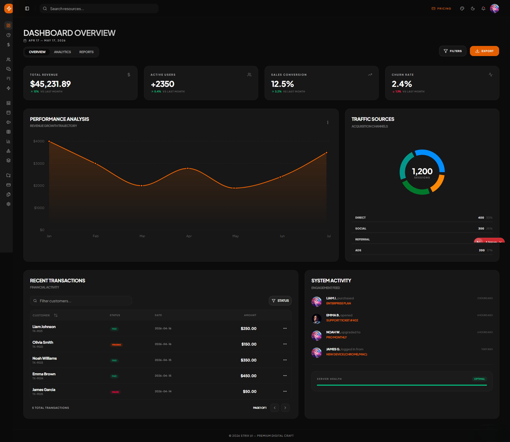
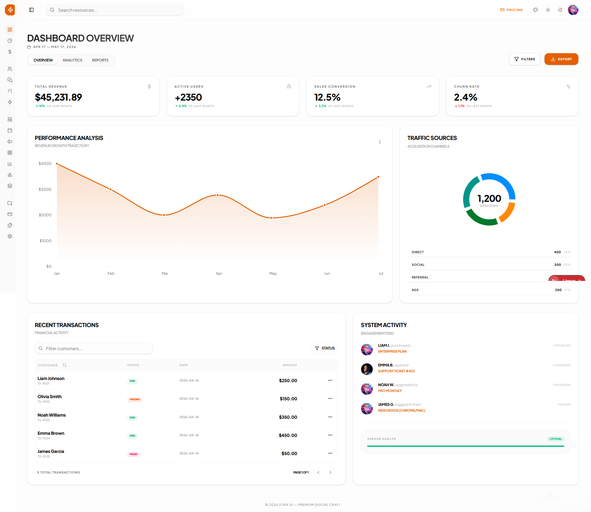
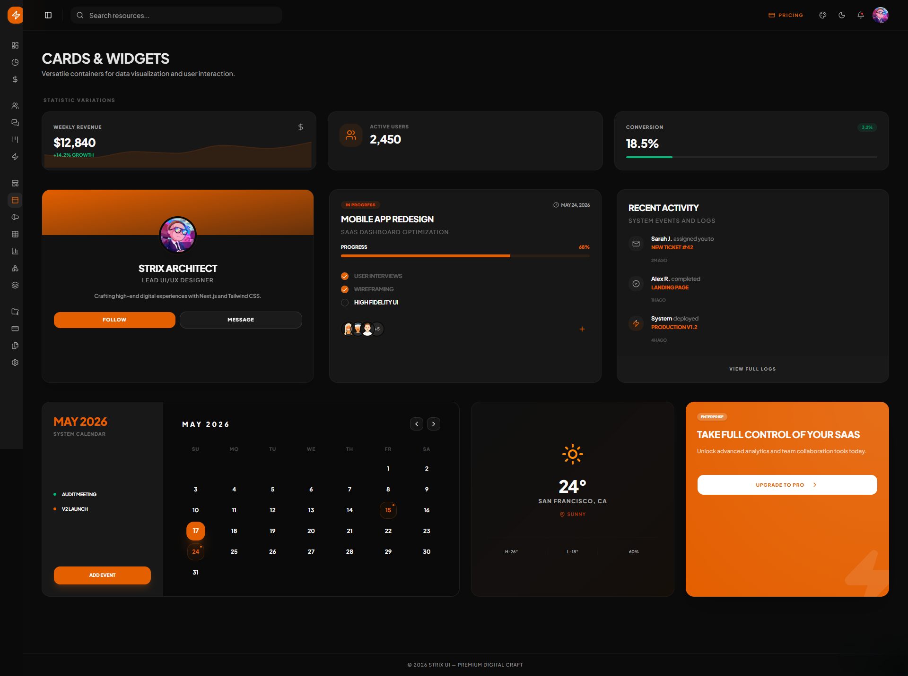
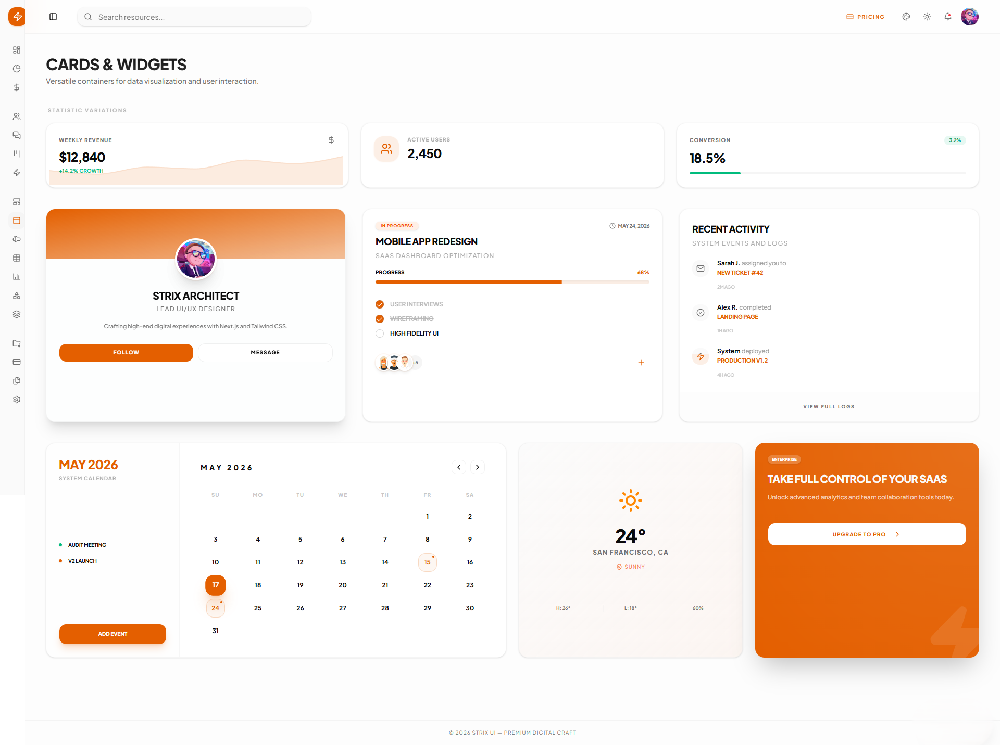
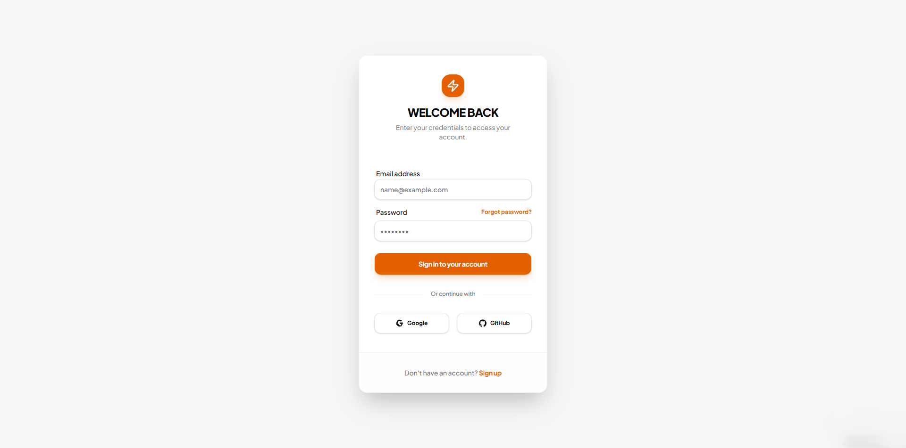

# Strix UI

### The ultimate foundation for enterprise-grade SaaS applications. Built with **Next.js 15**, **Tailwind CSS v4**, and **React 19**.

Strix UI is a premium admin dashboard template designed for developers who demand performance, scalability, and a cutting-edge developer experience. It provides a robust, flat architecture and a suite of professional components to accelerate your production workflow.

---

## 🖼️ Preview

<div align="center">
  
  
  <br />
  
  
  <br />
  
  
</div>

---

## ✨ Key Features

*   🚀 **Modern Stack** – Powered by **Next.js 15** (App Router), **React 19**, and **TypeScript** for type-safe, concurrent rendering.
*   🎨 **Tailwind CSS v4** – Utilizing the latest evolution of utility-first CSS for lightning-fast styling and reduced bundle sizes.
*   🏗️ **Modular Architecture** – A clean, flat directory structure with independent modules for **Users**, **Settings**, **Messages**, and **Auth**.
*   💎 **Premium UI Components** – Includes advanced **Kanban boards**, **Real-time Chat interfaces**, **Multi-step Wizards**, and professional modals.
*   ⚡ **Optimized Performance** – Architected for speed, aiming for **100/100 Lighthouse scores** out of the box.
*   🌗 **Native Dark Mode** – Seamless Light/Dark mode transitions powered by **Shadcn/UI** and CSS variables.

---

## 📂 Project Structure

Strix UI follows a modular "feature-first" organization to ensure the codebase remains maintainable as your application grows.

```text
app/                  # Next.js App Router (Routes & Pages)
├── applications/     # Kanban, Wizard, and complex apps
├── auth/             # Login, Register, Forgot Password flows
├── dashboard/        # Main analytics and finance views
├── users/            # User management and roles
└── settings/         # Profile and application settings
components/           # UI Component Library
├── ui/               # Primitive components (Shadcn/UI)
├── layout/           # Sidebar, Topbar, and Shell wrappers
└── dashboard/        # Feature-specific dashboard widgets
config/               # Navigation and global constants
hooks/                # Custom React hooks (e.g., use-mobile)
lib/                  # Utility functions and mock data
```

---

## 🚀 Getting Started

Follow these steps to get your local development environment up and running.

### 1. Clone the repository
```bash
git clone https://github.com/AnthonyXJ99/strixui.git
cd strixui
```

### 2. Install dependencies
```bash
npm install
```

### 3. Run the development server
```bash
npm run dev
```
Open [http://localhost:3000](http://localhost:3000) in your browser to see the result.

---

## 🛠️ Tech Stack

| Technology | Description |
| :--- | :--- |
| **Next.js 15** | React Framework for the Web |
| **React 19** | The latest features of the React library |
| **TypeScript** | Static type checking for robust code |
| **Tailwind v4** | Next-generation utility-first CSS framework |
| **Shadcn/UI** | Reusable components built with Radix UI |
| **Lucide Icons** | Beautiful & consistent icon set |

---

## 👨‍💻 Author

**Developed with ❤️ by Anthony - Systems Engineer**

Android Developer with expertise in **Flutter** and **Jetpack Compose**. Also experienced in frontend development with **SAPUI5**. Focused on building scalable, aesthetic, and high-performance cross-platform solutions.

---

MIT License © 2026 Strix UI
